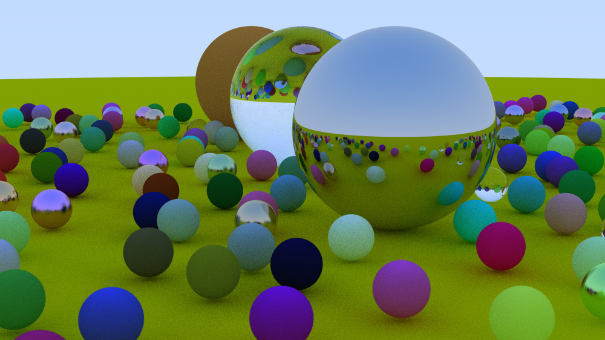

# saraytracer

Ray tracing a scene to an image in rust.

Features: 
- Materials (Diffuse, Metal, Dielectric)
- Reflection, Refraction, Scattering
- Runs efficiently due to parallelism provided by the [rayon crate.](https://crates.io/crates/rayon)

Thanks [_Ray Tracing in One Weekend_](https://raytracing.github.io/books/RayTracingInOneWeekend.html) :)

